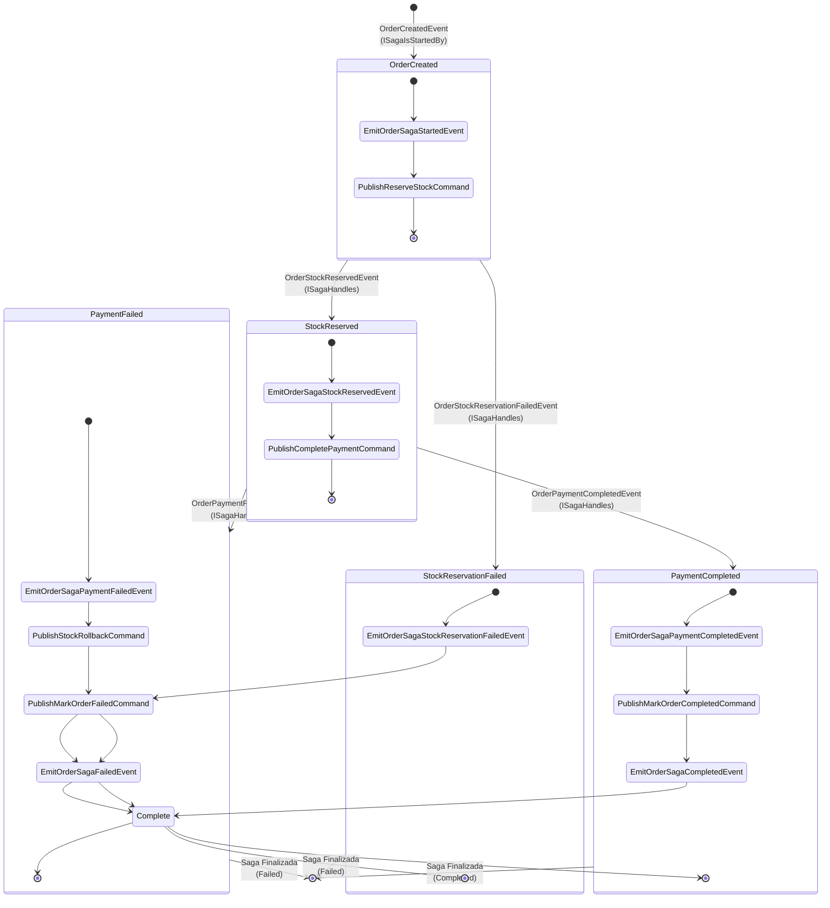
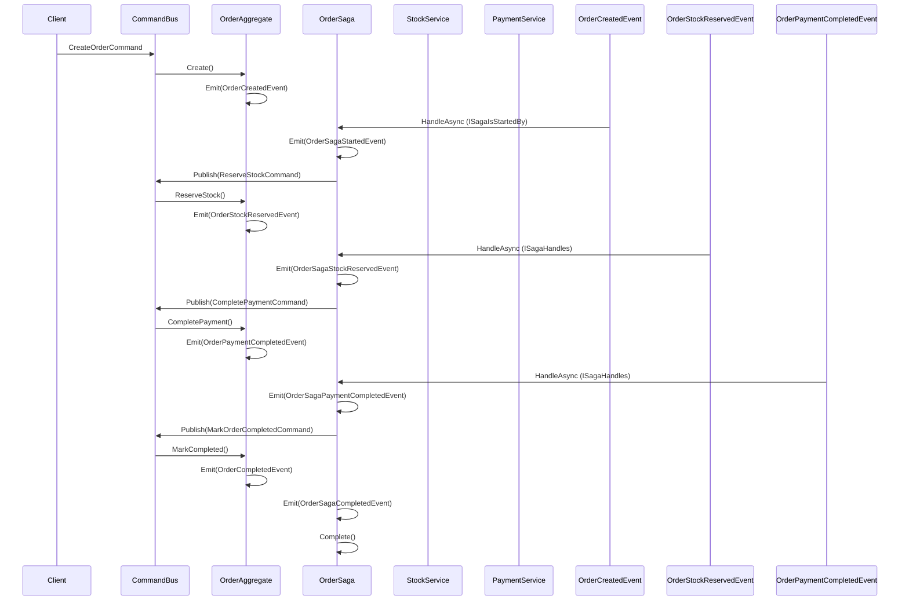
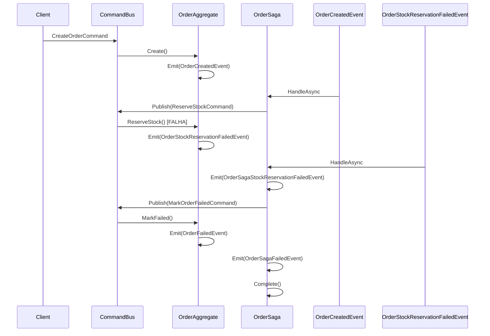
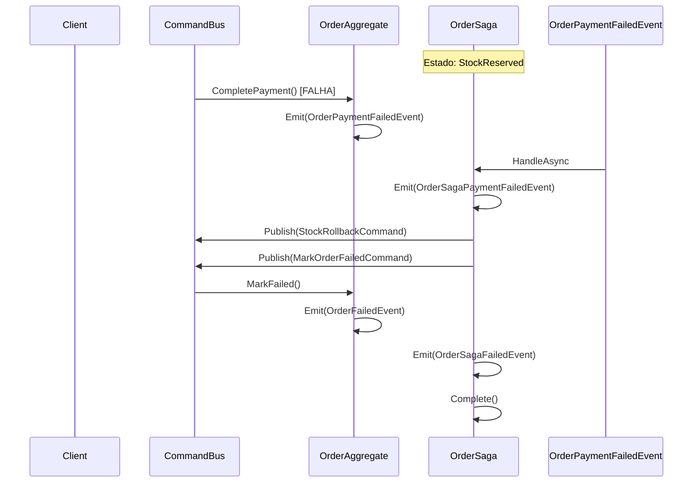
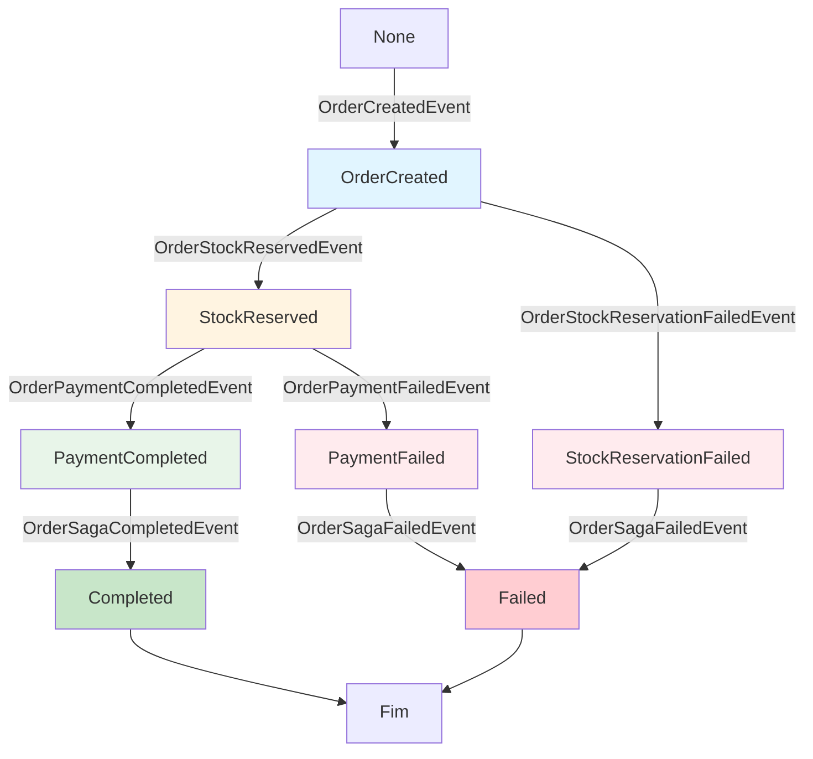

# OrderSaga - Diagrama de Fluxo

## Fluxo Principal (Happy Path)

## Fluxo de Erro - Falha na Reserva de Estoque

## Fluxo de Erro - Falha no Pagamento (com Rollback)

## Estados da Saga

## Comandos Publicados pela Saga

| Estado Atual | Evento Recebido | Comando Publicado | Próximo Estado |
|--------------|-----------------|-------------------|----------------|
| New | OrderCreatedEvent | ReserveStockCommand | OrderCreated |
| OrderCreated | OrderStockReservedEvent | CompletePaymentCommand | StockReserved |
| OrderCreated | OrderStockReservationFailedEvent | MarkOrderFailedCommand | StockReservationFailed |
| StockReserved | OrderPaymentCompletedEvent | MarkOrderCompletedCommand | PaymentCompleted |
| StockReserved | OrderPaymentFailedEvent | StockRollbackCommand MarkOrderFailedCommand | PaymentFailed |

## Eventos Emitidos pela Saga

| Evento da Saga | Quando é Emitido | Dados |
|----------------|-----------------|-------|
| OrderSagaStartedEvent | Quando OrderCreatedEvent é recebido | OrderId, CustomerId, PaymentAccountId, OrderItems, TotalPrice, CreatedDate |
| OrderSagaStockReservedEvent | Quando OrderStockReservedEvent é recebido | ReservedDate |
| OrderSagaStockReservationFailedEvent | Quando OrderStockReservationFailedEvent é recebido | ErrorMessage, FailedDate |
| OrderSagaPaymentCompletedEvent | Quando OrderPaymentCompletedEvent é recebido | CompletedDate |
| OrderSagaPaymentFailedEvent | Quando OrderPaymentFailedEvent é recebido | ErrorMessage, FailedDate |
| OrderSagaCompletedEvent | Após publicar MarkOrderCompletedCommand | CompletedDate |
| OrderSagaFailedEvent | Após publicar MarkOrderFailedCommand | ErrorMessage, FailedDate |

