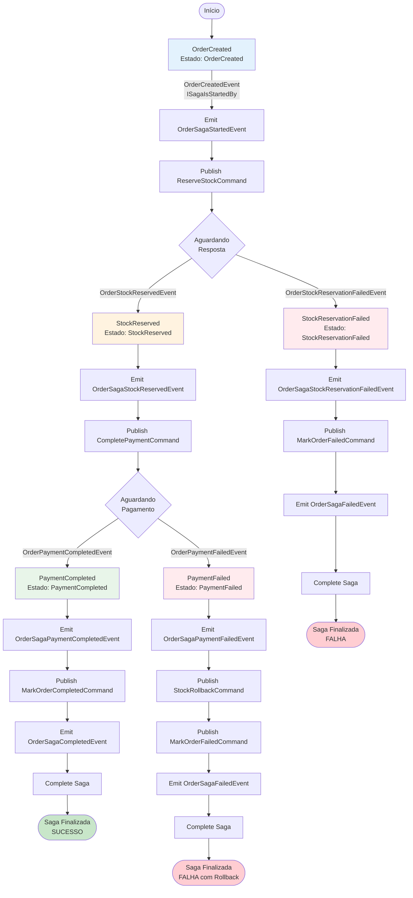
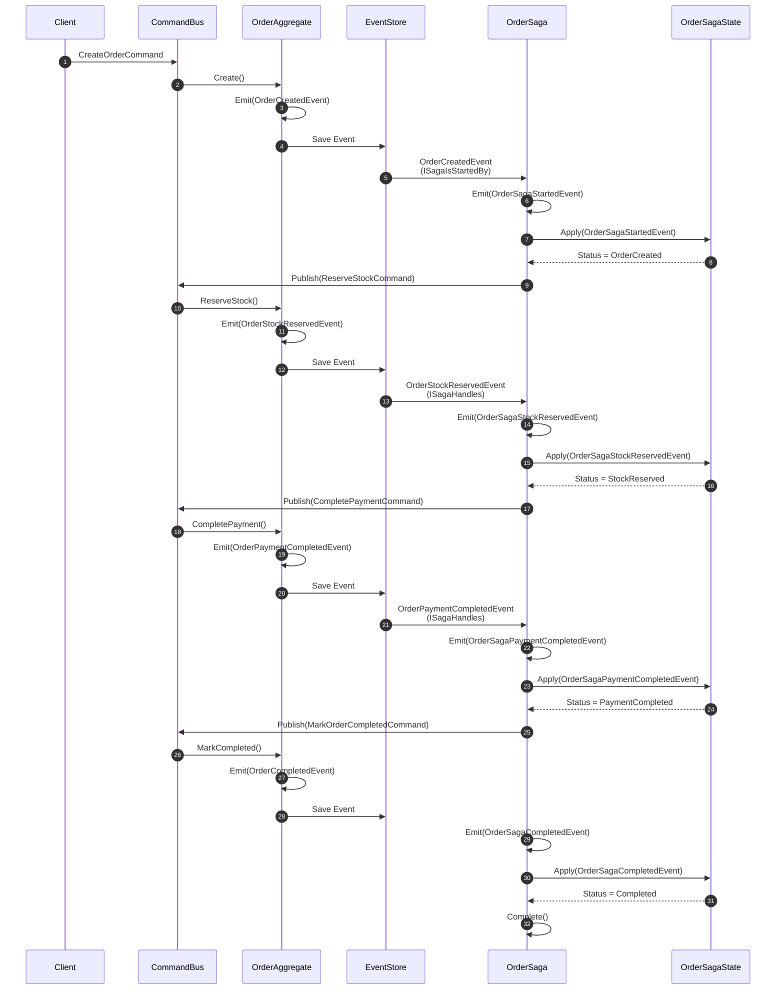
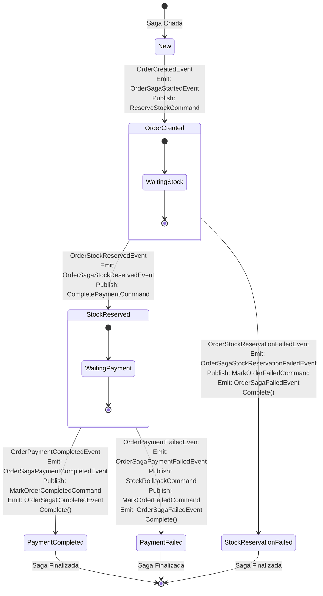
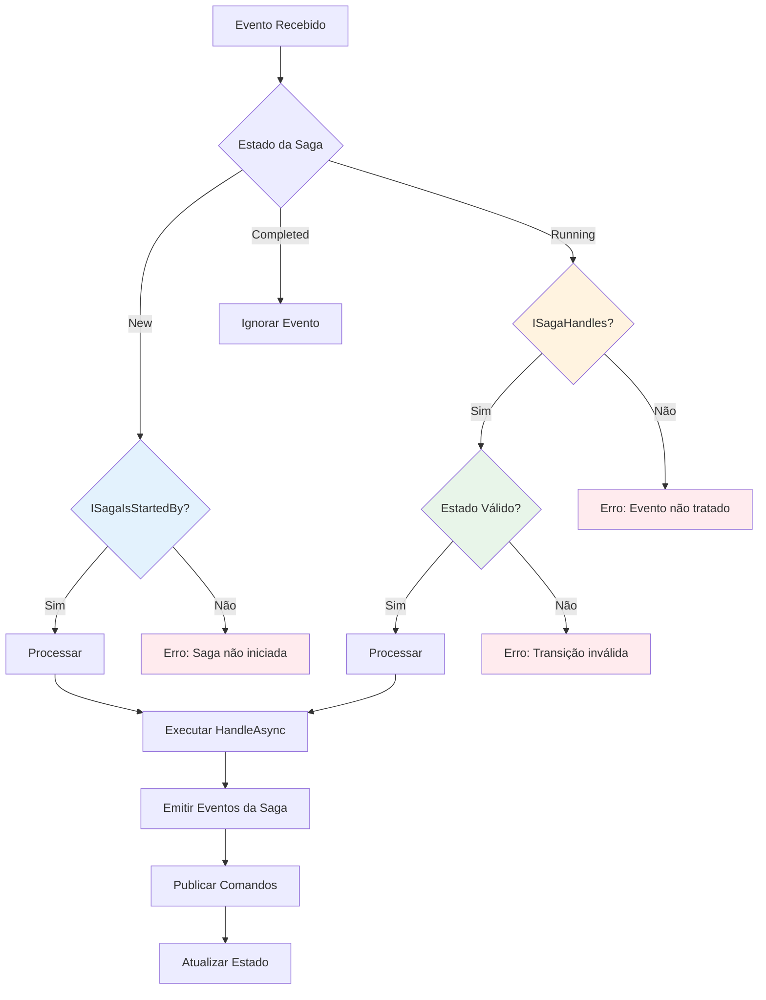

# OrderSaga - Diagrama Completo de Fluxo

## Diagrama Principal - Máquina de Estados

## Diagrama de Sequência - Fluxo Completo (Happy Path)

## Diagrama de Estados - Transições

## Tabela de Transições e Ações

| Estado Atual | Evento Recebido | Interface | Ação 1 | Ação 2 | Ação 3 | Próximo Estado |
|--------------|----------------|-----------|--------|--------|--------|----------------|
| New | OrderCreatedEvent | ISagaIsStartedBy | Emit OrderSagaStartedEvent | Publish ReserveStockCommand | - | OrderCreated |
| OrderCreated | OrderStockReservedEvent | ISagaHandles | Emit OrderSagaStockReservedEvent | Publish CompletePaymentCommand | - | StockReserved |
| OrderCreated | OrderStockReservationFailedEvent | ISagaHandles | Emit OrderSagaStockReservationFailedEvent | Publish MarkOrderFailedCommand | Emit OrderSagaFailedEvent + Complete() | StockReservationFailed |
| StockReserved | OrderPaymentCompletedEvent | ISagaHandles | Emit OrderSagaPaymentCompletedEvent | Publish MarkOrderCompletedCommand | Emit OrderSagaCompletedEvent + Complete() | PaymentCompleted |
| StockReserved | OrderPaymentFailedEvent | ISagaHandles | Emit OrderSagaPaymentFailedEvent | Publish StockRollbackCommand | Publish MarkOrderFailedCommand + Emit OrderSagaFailedEvent + Complete() | PaymentFailed |

## Validações de Estado

## Resumo da OrderSaga

### Interfaces Implementadas
- `ISagaIsStartedBy<OrderAggregate, OrderId, OrderCreatedEvent>` - Inicia a saga
- `ISagaHandles<OrderAggregate, OrderId, OrderStockReservedEvent>` - Processa reserva de estoque
- `ISagaHandles<OrderAggregate, OrderId, OrderStockReservationFailedEvent>` - Processa falha na reserva
- `ISagaHandles<OrderAggregate, OrderId, OrderPaymentCompletedEvent>` - Processa pagamento completo
- `ISagaHandles<OrderAggregate, OrderId, OrderPaymentFailedEvent>` - Processa falha no pagamento

### Eventos Emitidos pela Saga
1. **OrderSagaStartedEvent** - Saga iniciada
2. **OrderSagaStockReservedEvent** - Estoque reservado
3. **OrderSagaStockReservationFailedEvent** - Falha na reserva
4. **OrderSagaPaymentCompletedEvent** - Pagamento completo
5. **OrderSagaPaymentFailedEvent** - Falha no pagamento
6. **OrderSagaCompletedEvent** - Saga completada com sucesso
7. **OrderSagaFailedEvent** - Saga finalizada com falha

### Comandos Publicados pela Saga
1. **ReserveStockCommand** - Reservar estoque
2. **CompletePaymentCommand** - Processar pagamento
3. **StockRollbackCommand** - Rollback de estoque (compensação)
4. **MarkOrderCompletedCommand** - Marcar pedido como completo
5. **MarkOrderFailedCommand** - Marcar pedido como falho

